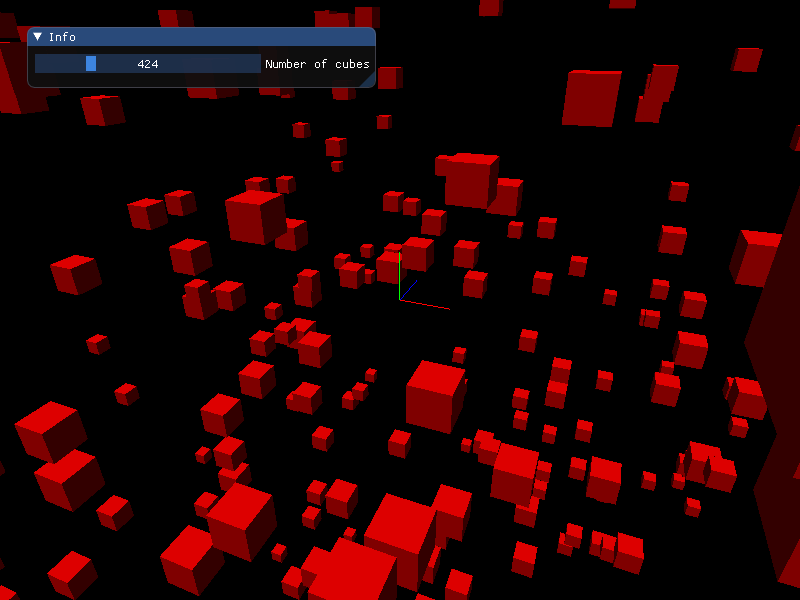

# cube rain

One of my OpenGL ES 3 based mini project, the goal here is to make rain of cubes with a camera system and diffuse lighting. Sample shows how to set up a scene with camera and moving objects in it all rendered with diffuse based lighting shader program. How to handle user input (mouse and keyboard) to change camera rotation, pan and zoom. How to calculate per triangle model normal vectors to support lighting.




## controls

**space:** freeze time, **left mouse:** rotate camera, **right mouse:** pan camera

## building

Building is easy, all we need to do is

```sh
cd cube_rain
scons -j4
```

but before we can do it we need to install *glfw3*, *glew* and *scons* libraries.

> **Note:** in Ubuntu 19.10 use
>
> ```sh
> sudo apt install libglfw3-dev libglew-dev scons
> ```
>
> command.

After successful build, `./cube_rain` command can be used to run sample.  
